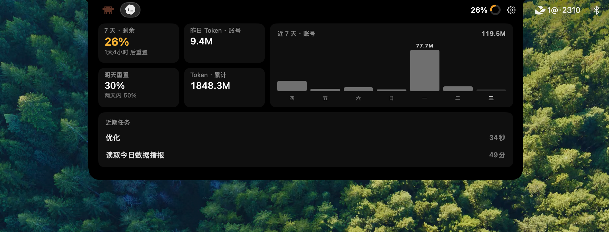

# Claude Notch — Simplified Chinese Edition

**See live Claude and Codex quotas, reset times, and recent activity in your Mac notch.**

&nbsp; 
&nbsp; 

This is a Simplified Chinese edition built on
[stevemcqueenz/claude-notch-tracker](https://github.com/stevemcqueenz/claude-notch-tracker).
It retains the upstream MIT license and attribution.

[中文说明](README.md)

## Latest UI

## Highlights

- Simplified Chinese interface with a one-page expanded layout for both Claude and Codex.
- Hover to expand, smooth expand/collapse movement, and a settings gear at the right edge.
- Independent notch windows on every display, with compact activity indicators while collapsed.
- Claude reads the official Claude Desktop usage cache by default and does not automatically access Keychain data, reducing repeated password prompts.
- Claude Pro hides inapplicable Fable and credit information; Max keeps the applicable capabilities.
- Codex numbers and ring both represent **remaining quota**, with 7-day quota, reset time, recent tasks, and a desktop widget.
- The Codex reset tile combines local reset timing with third-party parsed Tibo announcement signals; it does not read X directly.

## Install

Download the DMG from [Releases](../../releases), open it, and drag `Claude Notch.app` to Applications.

The current release is ad-hoc signed and not Apple-notarized. If macOS blocks the first launch,
open “System Settings → Privacy & Security” and choose “Open Anyway”.

## Data and Privacy

- Claude reads only the local Claude Desktop cache by default. It does not read browser or Claude Code credentials. Claude Desktop credential fallback is available only when the user enables it in Settings.
- Codex uses the official local `codex app-server`; prompts, account emails, and login tokens are neither read nor uploaded.
- Reset reminders request only anonymous public JSON from `codex-reset.com`; that service parses Tibo’s X announcements.

## License and Credits

Released under the [MIT License](LICENSE). Special thanks to **Stanislav Kulik**, creator of the original repository, for the design, implementation, and open-source contribution, and to all upstream contributors.
