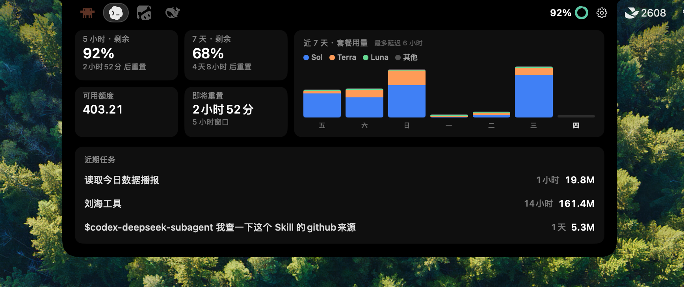
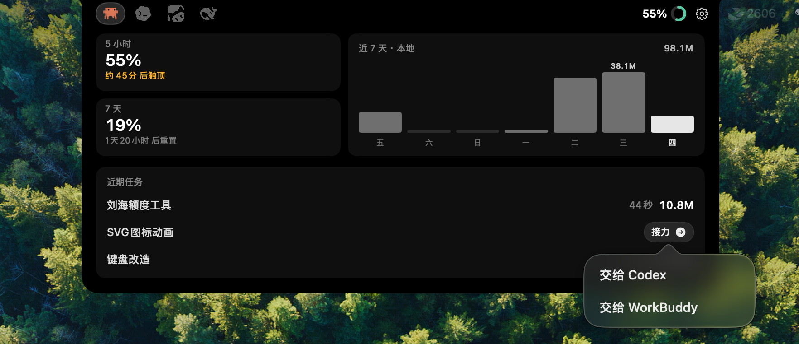
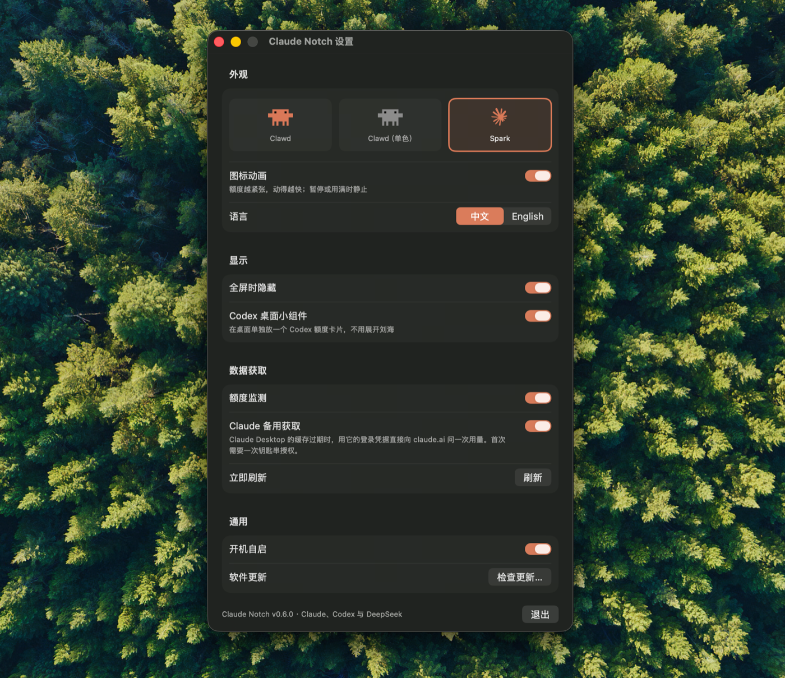

# Claude Notch 中文版

**在 Mac 刘海查看 Claude 与 Codex 的实时额度，并让任务在两者之间安全接力。**

&nbsp; 
&nbsp; 

这是基于 [stevemcqueenz/claude-notch-tracker](https://github.com/stevemcqueenz/claude-notch-tracker)
继续开发的简体中文版本，保留上游的 MIT 许可证与版权说明。

[English README](README.en.md)

## 核心能力：Claude ↔ Codex 可见上下文接力

Claude Notch 不只展示额度。把鼠标移到展开后的“近期任务”上，可以将已停止的任务直接
**交给 Claude** 或 **交给 Codex**，由另一端继续完成。

- **双向接力**：Codex 任务可交给 Claude Desktop 的 Code 会话，Claude Code 会话也可交给 Codex。
- **保留可验证现场**：带入任务目标、可见进度、工作目录、工作区、Git 分支与改动摘要、待办事项。
- **不复制隐藏内容**：思考过程、工具调用与输出、token、Cookie、私钥、`.env` 等敏感信息不会进入交接包。
- **避免同时改文件**：来源任务工作中或思考中时禁止接力；只有停止、空闲或等待确认时才能手动触发。
- **失败可恢复**：目标应用或深链打开失败时，交接包仍保留，并自动复制接力指令供手动继续。

## 最新效果

## 主要功能

- Claude 与 Codex 双向可见上下文接力，让任务在两个 Agent 之间继续完成；任务也可以交给 WorkBuddy。
- 中文 / English 界面切换；Claude 和 Codex 展开后均为单页信息布局。
- 鼠标悬停展开，展开与收起使用平滑位移动画；点右侧齿轮打开独立设置窗口。
- 多显示器独立显示、独立展开；收起时以小圆点提示工作中、思考中或待确认状态。
- Claude 默认只读取 Claude Desktop 缓存的官方额度数据，不自动访问钥匙串，避免重复密码弹窗。
- Claude Pro 会隐藏不适用的 Fable 和可用额度；Max 保留相应能力。
- Codex 数字和圆环都表示**剩余额度**；支持 7 天额度、重置时间、近期任务与桌面组件。
- Codex 近 7 天套餐用量按 Sol / Terra / Luna 分色堆叠，数据取自官方 Analysis 页同款接口。
- Codex 的”重置”格子结合本地倒计时与第三方已解析的 Tibo 公告信号；它不直接读取 X。
- WorkBuddy 额度独立成 Tab，显示剩余额度、套餐与刷新时间。

## 安装

从 [Releases](../../releases) 下载 DMG，打开后把 `Claude Notch.app` 拖入“应用程序”。

当前发布包为本机 ad-hoc 签名，尚未经过 Apple 公证。首次打开如被系统拦截，到
“系统设置 → 隐私与安全性”选择“仍要打开”。

## 数据与隐私

- Claude 默认只读 Claude Desktop 的本地缓存；不读取浏览器或 Claude Code 凭证。只有用户在设置中手动开启“Claude 备用获取”后，才会读取 Claude Desktop 自身的授权信息。
- 开启“Claude 备用获取”后，第一次读取会弹一次系统钥匙串授权；取得的 16 字节解密密钥随后以 `0600` 权限缓存在 `~/Library/Application Support/ClaudeNotch/Keys/`，此后不再访问钥匙串。这么做是因为没有 Apple 证书签名的构建每次更新都会被 macOS 当成另一个程序，“始终允许”随之失效，不缓存就会每装一次新版重输一次密码。不想要这份缓存，删掉该目录即可恢复每次询问。
- Codex 使用官方本地 `codex app-server`；不读取或上传提示词、账号邮箱和登录 token。
- Codex 近 7 天套餐用量取自官方 `chatgpt.com` 的只读接口，与 Codex 设置里的 Analysis 页同源；凭据与返回内容只在内存中使用，不落盘、不记日志。
- WorkBuddy 读取本机 CodeBuddy 的登录信息，向 `copilot.tencent.com` 查询额度。
- 重置提醒只请求不带鉴权、不携带用户信息的 `codex-reset.com` 公开 JSON；该网站负责解析 Tibo 的 X 公告。

## 开源许可证与致谢

本项目按 [MIT License](LICENSE) 开源。感谢原仓库作者 **Stanislav Kulik** 的设计、实现与开源分享，也感谢所有上游贡献者。
